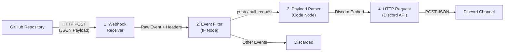
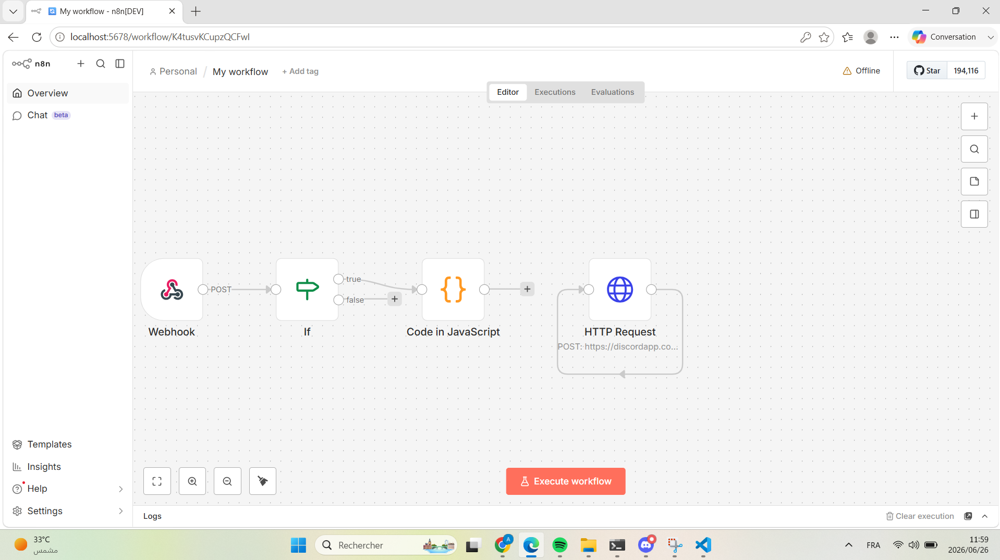
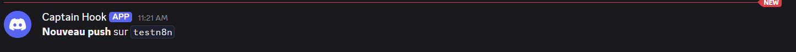
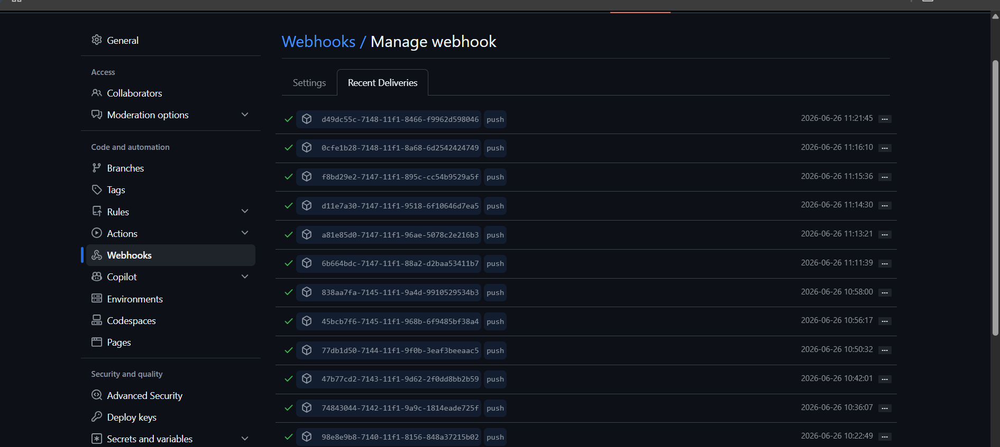

<div align="center">
  

  <h1>GitHub Discord Notification Bot</h1>

  <p>A production-ready n8n workflow that forwards GitHub webhook events as rich Discord embed notifications.</p>

  <!-- Badges -->
  <p>
    <a href="https://n8n.io">
      
    </a>
    <a href="LICENSE">
      
    </a>
    <a href="https://github.com/yourusername/github-discord-notification-bot/issues">
      
    </a>
    <a href="https://discord.com/developers/docs/resources/webhook">
      
    </a>
  </p>
</div>

---

## Table of Contents

- [About](#about)
- [Features](#features)
- [Architecture](#architecture)
- [Workflow Explanation](#workflow-explanation)
- [Example Discord Embed](#example-discord-embed)
- [Quick Start](#quick-start)
- [GitHub Webhook Configuration](#github-webhook-configuration)
- [Screenshots](#screenshots)
- [Future Improvements](#future-improvements)
- [Technologies](#technologies)
- [License](#license)

---

## About

This project connects GitHub and Discord through an automated n8n workflow. When you push code or open a pull request, a beautifully formatted Discord embed appears in your server channel instantly. No third-party services, no monthly subscriptions — just pure automation powered by n8n.

It is designed for engineering teams who want real-time visibility into their GitHub activity without leaving Discord.

---

## Features

| Feature | Description |
|---------|-------------|
| **Push Notifications** | Get instant Discord embeds every time code is pushed to any branch |
| **Pull Request Notifications** | Receive notifications when PRs are opened, closed, or merged |
| **Rich Discord Embeds** | Color-coded embeds with repository info, commit details, author, and branch |
| **Event Filtering** | Only `push` and `pull_request` events are processed; everything else is silently dropped |
| **JavaScript Payload Processing** | Custom JavaScript transforms raw GitHub payloads into structured Discord embed objects |
| **Environment Variable Configuration** | Discord webhook URL stored as an environment variable — no hardcoded secrets |
| **Easy Deployment** | Import the workflow JSON, configure two webhooks, and activate — done |

---

## Architecture



The workflow follows a linear pipeline architecture — each node has a single responsibility, making it trivial to debug, extend, or replace individual components.

[Detailed architecture documentation →](docs/architecture.md)

---

## Workflow Explanation

### 1. Webhook Node — Entry Point

Receives all incoming HTTP POST requests from GitHub on the path `/webhook/github-webhook`. Every GitHub event (push, pull request, issues, stars, etc.) arrives here first. The node captures both the HTTP headers (containing the event type) and the full JSON body.

### 2. IF Node — Event Filter

Checks the `x-github-event` header against an allowlist of `["push", "pull_request"]`. If the event type matches, execution continues. If not, the workflow terminates silently — this prevents unnecessary Discord API calls and keeps your channels clean.

**Why only push and pull_request?** These are the two highest-signal events for development teams. The filter array can be extended to include `issues`, `release`, `star`, `fork`, and others.

### 3. Code Node — Discord Embed Builder

JavaScript code that parses the GitHub payload and constructs a Discord Embed object. For push events, it extracts the branch name, commit list (up to 5, with truncated SHAs and clickable URLs), author, and repository. For pull request events, it detects the action (`opened`, `closed`, `merged`, `reopened`, `synchronize`) and applies a dynamic color scheme:
- **Green** for opened/reopened
- **Red** for closed (unmerged)
- **Purple** for merged
- **Yellow** for synchronize (new commits pushed to the PR branch)

### 4. HTTP Request Node — Discord Dispatcher

Makes an HTTP POST request to the Discord webhook URL (read from the `DISCORD_WEBHOOK_URL` environment variable) with the constructed embed object. Discord renders the embed in the configured channel automatically.

[Full setup instructions →](docs/setup.md)

---

## Example Discord Embed

Below is a realistic example of what a push notification looks like in Discord:

```

┌─────────────────────────────────────────────────────────┐
│ 🚀 [johndoe/my-awesome-project] New Push to main       │
│                                                         │
│ [`9uts876`](https://github.com/johndoe/my-awesome-     │
│ project/commit/9uts876...) feat(api): add rate limiting │
│ middleware for GraphQL endpoint                          │
│                                                         │
│ [`8fge765`](https://github.com/johndoe/my-awesome-     │
│ project/commit/8fge765...) fix(database): resolve       │
│ connection pool exhaustion under load                   │
│                                                         │
│ [`7efd654`](https://github.com/johndoe/my-awesome-     │
│ project/commit/7efd654...) chore(deps): upgrade axios  │
│ to 1.7.2 and express to 4.19.0                          │
│                                                         │
│ 📦 Repository  │ 🌿 Branch   │ 📝 Commits │ 👤 Author │
│ johndoe/       │ `main`      │ 3          │ johndoe   │
│ my-awesome-    │             │            │            │
│ project        │             │            │            │
│                                                         │
│ GitHub Discord Notification Bot            Jun 26, 2026 │
└─────────────────────────────────────────────────────────┘

```

For pull request events:

```

┌─────────────────────────────────────────────────────────┐
│ 🎉 [johndoe/my-awesome-project] Pull Request Merged    │
│                                                         │
│ ### [Add user authentication middleware](https://...pr/1│
│ 42)                                                      │
│                                                         │
│ 📦 Repository   │ 🔀 PR Number │ 📋 Status │ 👤 Author│
│ johndoe/        │ #142         │ Merged    │ janesmith│
│ my-awesome-     │              │           │           │
│ project         │              │           │           │
│                                                         │
│ 🌿 Base `main`  │ 🔀 Head `feat/auth-middleware`       │
│                                                         │
│ GitHub Discord Notification Bot            Jun 26, 2026 │
└─────────────────────────────────────────────────────────┘

```

---

## Quick Start

```bash
# 1. Install n8n globally
npm install n8n -g

# 2. Launch n8n
n8n start

# 3. Open http://localhost:5678 and create your account

# 4. Import the workflow from this repository
#    Workflows → Import → workflow/github-discord-workflow.json

# 5. Set the Discord webhook URL as an environment variable
#    Settings → Environment Variables → DISCORD_WEBHOOK_URL

# 6. Expose n8n to the internet (ngrok recommended for testing)
ngrok http 5678

# 7. Configure the GitHub webhook (see below)

# 8. Activate the workflow
```

> **Complete step-by-step guide**: [docs/setup.md](docs/setup.md)

---

## GitHub Webhook Configuration

Navigate to your repository → **Settings** → **Webhooks** → **Add webhook** and use these settings:

| Setting | Value | Notes |
|---------|-------|-------|
| **Payload URL** | `https://your-n8n-instance.com/webhook/github-webhook` | Replace with your actual n8n URL |
| **Content type** | `application/json` | Required for proper payload parsing |
| **Secret** | *(optional)* | Add a secret token for HMAC verification |
| **SSL verification** | **Enable** | Disable only for local testing with ngrok |
| **Events — Push** | ✅ | Triggers on `git push` |
| **Events — Pull requests** | ✅ | Triggers on `opened`, `closed`, `reopened`, `synchronize` |
| **Active** | ✅ | Must be checked to receive deliveries |

> **Tip**: After saving, scroll down to **Recent Deliveries** and look for a green checkmark to confirm GitHub can reach your n8n instance.

---

## Screenshots

| # | Area | Screenshot |
|---|------|------------|
| 1 | Workflow Editor |  |
| 2 | Discord Notification |  |
| 3 | GitHub Webhook Config |  |
| 4 | Environment Variables | — |

---

## Future Improvements

| Feature | Description | Priority |
|---------|-------------|----------|
| **Issue Notifications** | Forward `issues` events (opened, closed, assigned) | Medium |
| **Release Monitoring** | Notify when new GitHub releases are published | Low |
| **Star & Fork Alerts** | Track repository popularity metrics | Low |
| **GitHub Actions Status** | Report workflow run results (success/failure) | High |
| **Slack Support** | Add a parallel webhook for Slack channels | Medium |
| **Microsoft Teams** | Support Teams connector webhooks | Low |
| **Email Notifications** | Send formatted emails via SMTP for critical events | Low |
| **AI Commit Summaries** | Generate natural-language summaries of push contents using LLMs | High |
| **Database Logging** | Persist events to a database for audit trails and analytics | Medium |
| **Dashboard UI** | Build a web dashboard to view event history and filter logs | Low |
| **Multi-Repository Support** | Allow a single n8n instance to handle webhooks from multiple repos | High |

Contributions are welcome! If you implement any of these features, open a pull request.

---

## Technologies

| Technology | Purpose |
|------------|---------|
| [n8n](https://n8n.io) | Workflow automation and orchestration engine |
| [JavaScript](https://developer.mozilla.org/en-US/docs/Web/JavaScript) | Payload transformation logic (ES6+) |
| [GitHub Webhooks](https://docs.github.com/en/developers/webhooks-and-events/webhooks) | Event-driven payload delivery from GitHub |
| [Discord Webhook API](https://discord.com/developers/docs/resources/webhook) | Message and embed delivery to Discord channels |
| [REST API](https://en.wikipedia.org/wiki/REST) | HTTP communication between all components |

---

## License

This project is licensed under the MIT License — see the [LICENSE](LICENSE) file for details.

---

<div align="center">
  <p>
    Built with <a href="https://n8n.io">n8n</a> &bull;
    Maintained by <a href="https://github.com/yourusername">@yourusername</a>
  </p>
  <p>
    <a href="#">Back to top</a>
  </p>
</div>
