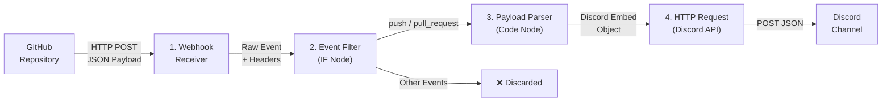

# Architecture

## Overview

The GitHub Discord Notification Bot is a pipeline-style n8n workflow that processes GitHub webhook events through four sequential nodes. Each node has a single responsibility, making the workflow easy to debug, extend, and maintain.

---

## Data Flow



---

## Node Breakdown

### 1. Webhook Node — Entry Point

**Purpose**: Receive incoming HTTP requests from GitHub.

**How it works**:
- Listens on the path `/webhook/github-webhook` for POST requests
- Captures the full HTTP request including headers, body, and query parameters
- GitHub sends the event type in the `x-github-event` header (e.g., `push`, `pull_request`, `issues`)
- The raw payload body contains the full GitHub event data

**Configuration highlights**:
- **Path**: `github-webhook`
- **Response Mode**: `On Received` — immediately acknowledges receipt to GitHub
- **No authentication** is configured at the webhook level; security can be added via GitHub Secrets and n8n credential validation

---

### 2. IF Node — Event Filter

**Purpose**: Gate the pipeline to only process relevant events, reducing noise and Discord API usage.

**How it works**:
- Reads the `x-github-event` header from the incoming request
- Uses an **isIn** comparison to check if the event is one of: `push`, `pull_request`
- If the condition matches, execution passes to the next node
- If the condition fails, execution stops and the event is silently discarded

**Why only push and pull_request?**
- These two events cover the most common development workflows
- Push events notify teams of new code
- Pull request events keep teams aligned on code reviews and merges
- Other events (issues, stars, forks, etc.) can be added by extending the filter array

**Configuration highlights**:

```json
{
  "conditions": {
    "string": [
      {
        "value1": "={{ $json.headers['x-github-event'] }}",
        "operation": "isIn",
        "value2": ["push", "pull_request"]
      }
    ]
  }
}
```

---

### 3. Code Node — Discord Embed Builder

**Purpose**: Parse the raw GitHub payload and construct a Discord Embed object.

**How it works**:

The JavaScript code runs inside n8n's execution environment with access to the full input data. It performs the following transformations:

#### For Push Events:

| Input | Output |
|-------|--------|
| `payload.ref` | Branch name (strips `refs/heads/` prefix) |
| `payload.repository.full_name` | Repository identifier (e.g., `owner/repo`) |
| `payload.commits[]` | List of commit messages with truncated SHAs and URLs |
| `payload.pusher.name` | Push author |

The embed includes:
- A color-coded sidebar (green for pushes)
- Repository name and link
- Branch name
- Commit count
- Up to 5 most recent commits with truncated hashes and messages
- Author name
- Timestamp

#### For Pull Request Events:

| Input | Output |
|-------|--------|
| `payload.action` | Action type: `opened`, `closed`, `reopened`, `synchronize` |
| `payload.pull_request.merged` | Whether the PR was merged (overrides `closed`) |
| `payload.pull_request.title` | PR title |
| `payload.pull_request.number` | PR number |
| `payload.pull_request.html_url` | Direct link to PR |
| `payload.pull_request.user.login` | PR author |
| `payload.pull_request.base.ref` | Base branch |
| `payload.pull_request.head.ref` | Head branch |

The embed uses dynamic color coding:
- Green (`#2ea043`) for opened/reopened
- Red (`#cf222e`) for closed without merge
- Purple (`#8250df`) for merged
- Yellow (`#e3b341`) for synchronize (new commits pushed to PR branch)

#### Error Handling:

The code safely handles missing fields with optional chaining and default values, ensuring partial payloads don't crash the workflow.

---

### 4. HTTP Request Node — Discord Dispatcher

**Purpose**: Deliver the constructed embed to Discord's Webhook API.

**How it works**:
- Makes an HTTP POST request to the Discord webhook URL
- Sends the `embeds` array from the Code node output as the request body
- Discord's API accepts the embed and renders it in the configured channel

**Configuration highlights**:
- **Method**: POST
- **URL**: Read from `$env.DISCORD_WEBHOOK_URL` (environment variable)
- **Content Type**: `application/json`
- **Body Parameters**: Sends `{ "embeds": [...] }`

#### Discord Embed Specification:

The embed object follows [Discord's Embed API](https://discord.com/developers/docs/resources/message#embed-object) specification:

```javascript
{
  title: "Event title with emoji prefix",
  url: "https://github.com/...",
  color: 0xHEXCODE,
  description: "Markdown-formatted description",
  fields: [
    { name: "Field Name", value: "Field Value", inline: true/false }
  ],
  timestamp: "ISO-8601 timestamp",
  footer: {
    text: "Footer text",
    icon_url: "https://..."
  }
}
```

---

## Security Considerations

### Environment Variables
- The Discord Webhook URL is stored as an n8n environment variable
- Never hardcode credentials in the workflow JSON or code

### GitHub Webhook Secrets
- GitHub supports [webhook secrets](https://docs.github.com/en/developers/webhooks-and-events/securing-your-webhooks) for HMAC verification
- n8n can validate HMAC signatures using a Code node if a secret is configured
- This is recommended for production deployments

### HTTPS
- Always use HTTPS in production
- GitHub requires HTTPS for webhooks (with exceptions for local testing)
- n8n supports TLS termination natively or via reverse proxy (nginx, Caddy)

---

## Extensibility

The pipeline architecture makes it straightforward to add functionality:

```
GitHub → Webhook → IF → [New Processing Nodes] → Discord
                           ↓
                     [Database Logger]
                           ↓
                     [AI Summary Service]
```

New nodes can be inserted between the IF node and the HTTP Request node without disrupting existing functionality.

---

## Performance Characteristics

- **Latency**: ~200-500ms from GitHub event to Discord notification (network-dependent)
- **Throughput**: Handles burst traffic with n8n's queue mode
- **Error recovery**: Failed Discord deliveries can be retried with n8n's error workflow feature
- **Rate limiting**: Discord webhooks allow 30 requests per second per webhook URL

---

## Related

- [Setup Guide](./setup.md) — Step-by-step configuration instructions
- [Example Payload](../examples/payload.json) — Sample GitHub push event payload
